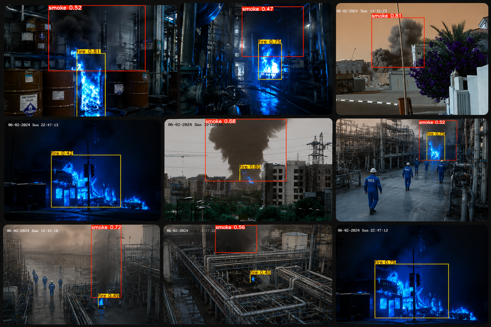

[](https://python.org)
[](https://ultralytics.com)
[](https://streamlit.io)
[](https://www.kaggle.com/models/shreya129/industrial-smoke-and-fire-detection-yolov8)
[](LICENSE)

<h1 align="center">🔥 Industrial Fire & Smoke Detection System</h1>

<p align="center"><strong>Industry-grade fire and smoke detection — custom-trained YOLOv8n model built for real-time deployment in CCTV and surveillance pipelines, with a Streamlit demo dashboard.</strong></p>

<p align="center">
  <a href="https://fire-smoke-detection-app.streamlit.app/">🚀 Live Demo</a> ·
  <a href="https://www.kaggle.com/models/shreya129/industrial-smoke-and-fire-detection-yolov8">📦 Kaggle Model</a> ·
  <a href="#-installation">Installation</a> ·
  <a href="#-features">Features</a>
</p>

---

## 📖 Overview

A real-time fire and smoke detection system built end-to-end — from custom model training to a deployable inference pipeline. The model was trained on 14,000+ images using YOLOv8n and achieves **0.776 mAP50** with **0.718 recall** across fire and smoke classes.

**Target deployment:** This system is designed for integration into CCTV and IP camera pipelines in industrial environments such as factories, warehouses, construction sites, and server rooms — anywhere early fire and smoke detection is critical. The Streamlit dashboard serves as a demonstration interface; the underlying model can be plugged directly into any OpenCV-based RTSP/camera stream.

<p align="center">
  
</p>

---

## 📦 Model

The trained model is publicly available on Kaggle:
> 🔗 **[shreya129/industrial-smoke-and-fire-detection-yolov8](https://www.kaggle.com/models/shreya129/industrial-smoke-and-fire-detection-yolov8)**

The weights (`best_shreya_v2.pt`) are also included directly in this repository for convenience.

| Metric | Overall | Smoke | Fire |
|--------|---------|-------|------|
| **Precision** | 0.760 | 0.799 | 0.721 |
| **Recall** | 0.718 | 0.772 | 0.665 |
| **mAP50** | 0.776 | 0.830 | 0.722 |
| **mAP50-95** | 0.440 | 0.505 | 0.374 |

**Architecture:** YOLOv8n (Nano) · **Model size:** 6.2 MB · **Input:** 640×640 · **Classes:** Fire, Smoke

---

## 🗃 Dataset & Training

| | Details |
|---|---|
| **Dataset** | [Smoke-Fire-Detection-YOLO](https://www.kaggle.com/datasets/sayedgamal99/smoke-fire-detection-yolo) by sayedgamal99 |
| **Train / Val / Test** | 14,122 / 3,099 / 4,306 images |
| **Baseline Training** | Google Colab (Tesla T4 GPU) · 20 epochs |
| **Fine-tuning** | Kaggle Notebooks (Tesla T4 GPU) · 50 additional epochs |
| **Base Model** | YOLOv8n pretrained on COCO |
| **Total Epochs** | 70 |
| **Key Settings** | `iou=0.5`, `cos_lr=True`, `lr0=0.005`, `mixup=0.15`, `copy_paste=0.3` |

---

## ✨ Features

| Mode | Description |
|---|---|
| 📷 **Image Upload** | Upload any image — instant detection with annotated output |
| 🎥 **Video Upload** | Frame-by-frame processing with live progress and aggregate stats |
| 📸 **Webcam** | Capture a snapshot and run instant detection |
| 🎬 **Demo Mode** | Auto-cycling slideshow through `demo_images/` — built for presentations |

---

## 🚀 Installation

```bash
git clone https://github.com/shreyaa4567/industrial-smoke-and-fire-detection.git
cd industrial-smoke-and-fire-detection

python -m venv .venv
.venv\Scripts\activate        # Windows
source .venv/bin/activate     # Linux / macOS

pip install -r requirements.txt
streamlit run appnew.py
```

App opens at `http://localhost:8501`

---

## 📁 Project Structure

```
industrial-smoke-and-fire-detection/
├── appnew.py                 # Main Streamlit application
├── cctv_stream.py            # CCTV / RTSP stream inference script
├── best_shreya_v2.pt         # Trained YOLOv8n model weights
├── requirements.txt          # Python dependencies
├── assets/                   # Screenshots and demo images
└── demo_images/              # Images for Demo Mode slideshow
```

---

## 🛠 Technologies Used

| Technology | Purpose |
|---|---|
|  | Core programming language |
|  | Web application framework & cloud deployment |
|  | Object detection model |
|  | Video processing & frame extraction |
|  | Image handling & manipulation |
|  | Numerical computation |
|  | Model fine-tuning (T4 GPU) |
|  | Baseline model training |

---

## 🏭 Industrial Use Case

Unlike generic object detectors, this model is trained specifically on real-world fire and smoke scenarios across varied lighting, environments, and scales. It is well-suited for:

- **CCTV integration** — Run inference on RTSP streams from IP cameras using OpenCV + YOLOv8
- **Factory & warehouse safety** — Early smoke detection before fire spreads
- **Automated alerting** — Trigger alarms or notifications when fire/smoke confidence exceeds a threshold
- **Edge deployment** — YOLOv8n's compact size makes it suitable for edge devices (Jetson Nano, Raspberry Pi with accelerator, etc.)

---

## 👤 Author

**Shreya Singh**
- GitHub: [@shreyaa4567](https://github.com/shreyaa4567)
- LinkedIn: [Shreya Singh](https://www.linkedin.com/in/shreya-singh-35bab7337/)
- Kaggle: [shreya129](https://www.kaggle.com/shreya129)

---

## 🙏 Acknowledgments

- [Ultralytics](https://ultralytics.com/) — YOLOv8 framework
- [sayedgamal99](https://www.kaggle.com/datasets/sayedgamal99/smoke-fire-detection-yolo) — Smoke-Fire-Detection-YOLO dataset
- [Streamlit](https://streamlit.io/) — Web framework and cloud deployment
- [Google Colab](https://colab.research.google.com/) — Baseline model training
- [Kaggle Notebooks](https://www.kaggle.com/code) — Fine-tuning and extended training