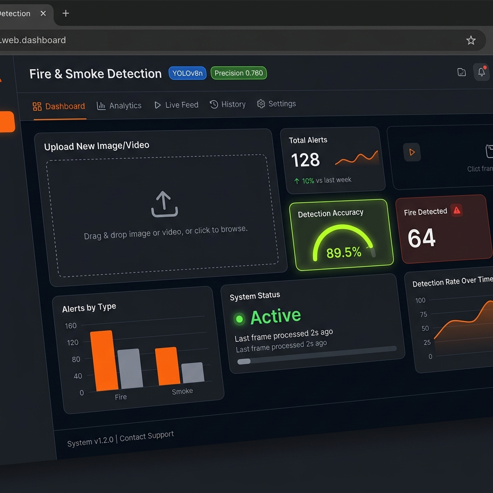
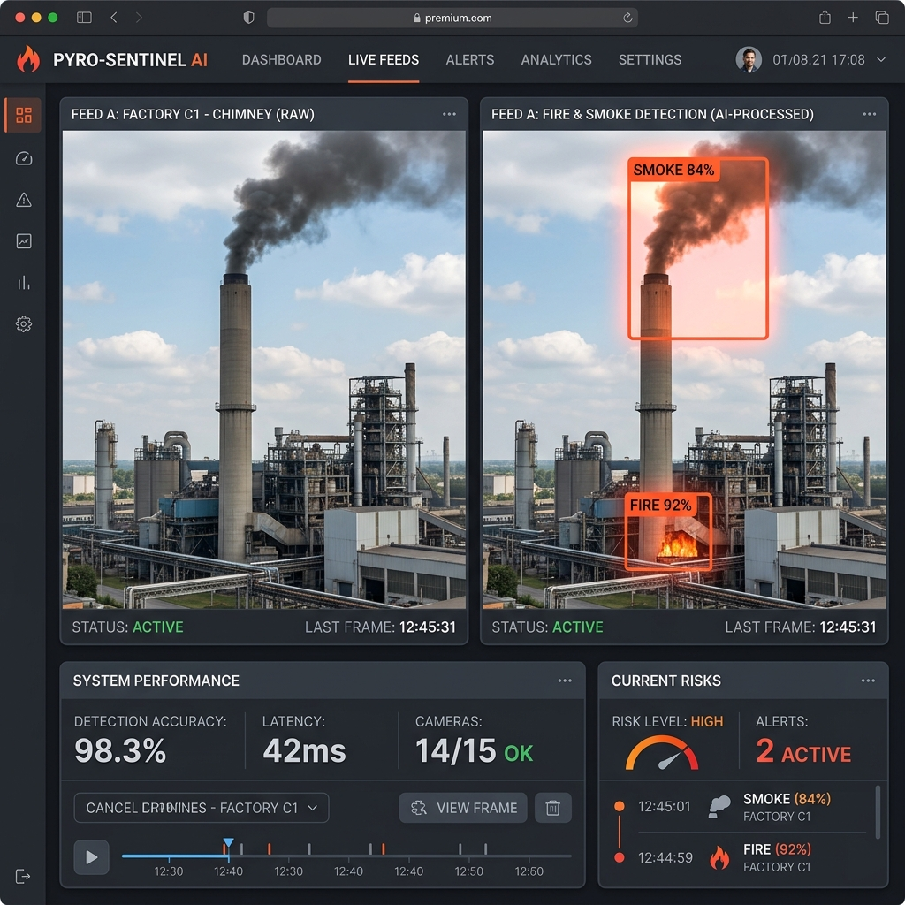
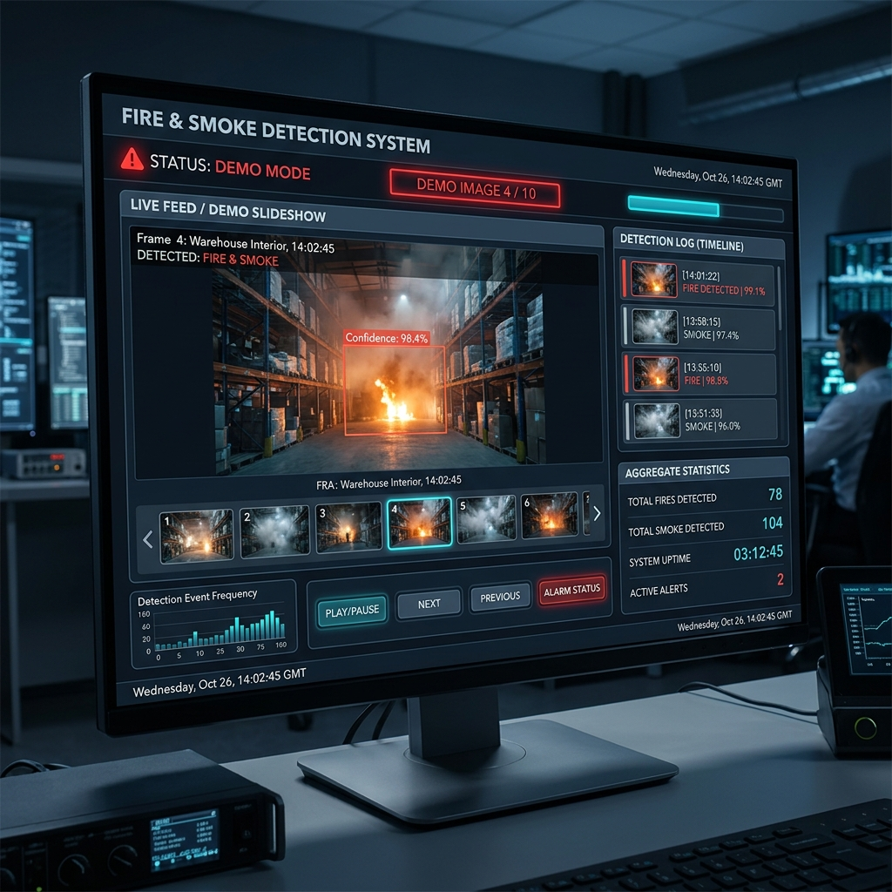
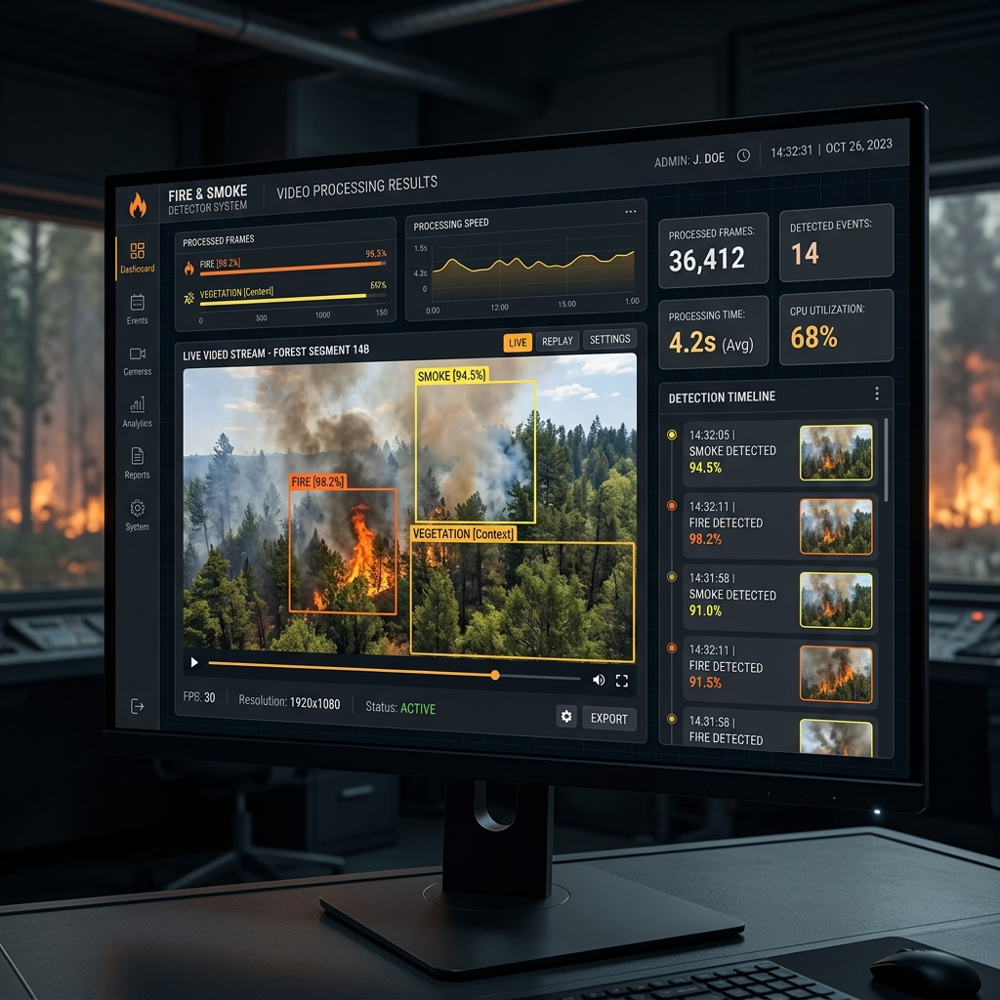
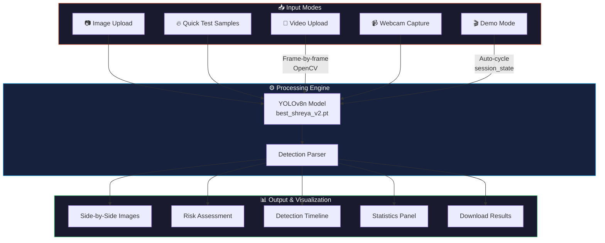

<p align="center">
  
  
  
  
  
  
</p>

<h1 align="center">🔥 Fire & Smoke Detection System</h1>

<p align="center">
  <strong>AI-powered fire and smoke detection with 5 analysis modes — built with YOLOv8 + Streamlit</strong>
</p>

<p align="center">
  <a href="#-features">Features</a> •
  <a href="#-demo">Demo</a> •
  <a href="#-installation">Installation</a> •
  <a href="#-usage">Usage</a> •
  <a href="#-model-performance">Model</a> •
  <a href="#-project-structure">Structure</a> •
  <a href="#-license">License</a>
</p>

---

## 📖 Overview

A full-featured, real-time fire and smoke detection application built with a **custom-trained YOLOv8n model** and a premium **dark industrial Streamlit dashboard**. The system supports image upload, video processing with annotated re-encoding, webcam capture, one-click sample testing, and an auto-cycling demo mode — making it a complete AI-powered safety monitoring solution.

Designed as a portfolio-grade project that demonstrates end-to-end deep learning deployment: from custom model training to a polished, production-ready web interface.

---

## ✨ Features

| Mode | Description |
|------|-------------|
| 📷 **Image Upload** | Drag & drop any image — instant YOLO detection with side-by-side comparison |
| 🔥 **Quick Test** | One-click sample images for instant demos — no upload needed |
| 🎥 **Video Upload** | Frame-by-frame YOLO processing → downloadable annotated video output |
| 📹 **Webcam** | Capture a snapshot with your webcam and run instant detection |
| 🎬 **Demo Mode** | Auto-cycling slideshow with Run/Stop controls for presentations |

### Dashboard Highlights

- **Risk Assessment Panel** — Real-time threat classification (High / Medium / Low / Safe)
- **Detection Timeline** — Scrollable, timestamped log of all detections
- **Detection Statistics** — Aggregate metrics: fire count, smoke count, avg/peak confidence
- **Info Cards** — Inference time, detections found, confidence, risk level
- **Dark Industrial UI** — Premium design with subtle animations and responsive layout
- **Download Results** — Export annotated images and re-encoded videos

---

## 🖼 Demo

<!-- Replace these with actual screenshots after running the app -->

### Dashboard Overview
<!--  -->
> 📸 *Add screenshot: Run the app and capture the full dashboard with header and mode selector*

### Image Detection
<!--  -->
> 📸 *Add screenshot: Upload a fire/smoke image and capture the detection results*

### Demo Mode
<!--  -->
> 📸 *Add screenshot: Start Demo Mode and capture it while cycling through images*

### Video Processing
<!--  -->
> 📸 *Add screenshot: Process a video and capture the annotated output with timeline*

---

## 🏗 Architecture



---

## 📊 Model Performance

The model was custom-trained using **YOLOv8n** on the [Smoke-Fire-Detection-YOLO](https://universe.roboflow.com) dataset.

| Metric | Value |
|--------|-------|
| **Architecture** | YOLOv8n (Nano) |
| **Precision** | 0.760 |
| **Recall** | 0.718 |
| **mAP50** | 0.776 |
| **Model Size** | 6.2 MB |
| **Classes** | Fire, Smoke |
| **Input Size** | 640 × 640 |

---

## 🚀 Installation

### Prerequisites

- Python 3.10 or higher
- pip (Python package manager)
- Webcam (optional, for Webcam Mode)

### Setup

```bash
# 1. Clone the repository
git clone https://github.com/shreyaa4567/fire-smoke-detection-app.git
cd fire-smoke-detection-app

# 2. Create a virtual environment
python -m venv .venv

# Windows
.venv\Scripts\activate

# Linux / macOS
source .venv/bin/activate

# 3. Install dependencies
pip install -r requirements.txt

# 4. Run the application
streamlit run appnew.py
```

The app will open automatically at `http://localhost:8501`.

### Adding Sample Images

For **Quick Test** and **Demo Mode** to work, add images to these folders:

```bash
# Quick Test samples (one-click testing)
samples/
├── wildfire.jpg
├── industrial_smoke.jpg
├── forest_fire.jpg
└── safe_scene.jpg

# Demo Mode images (auto-cycling slideshow)
demo_images/
├── fire_01.jpg
├── fire_02.jpg
├── smoke_01.jpg
└── ...
```

> **Tip:** Name sample files descriptively — the filename becomes the button label (e.g., `wildfire.jpg` → `🔥 Wildfire`).

---

## 💡 Usage

### 📷 Image Upload
1. Select **📷 Image Upload** mode
2. Drag & drop or browse for an image (JPG, PNG, BMP, WebP, TIFF)
3. View detection results: original vs annotated side-by-side
4. Check risk assessment, confidence stats, and download the result

### 🔥 Quick Test
1. Select **🔥 Quick Test** mode
2. Click any sample button to instantly run detection
3. No upload required — perfect for quick demos

### 🎥 Video Upload
1. Select **🎥 Video Upload** mode
2. Upload a video file (MP4, AVI, MOV, MKV)
3. Click **🔍 Process Video** to start frame-by-frame analysis
4. View the annotated video, detection timeline, and aggregate statistics
5. Download the annotated video with `detected_` prefix

### 📹 Webcam
1. Select **📹 Webcam** mode
2. Click **Take Photo** to capture a snapshot
3. View instant detection results

### 🎬 Demo Mode
1. Select **🎬 Demo Mode**
2. Click **▶ Run Demo** to start the auto-cycling slideshow
3. Watch as each image is analyzed with a 2-second interval
4. Monitor the status indicator: `Demo Image 3 / 10`
5. Click **⏹ Stop Demo** to halt at any time
6. Review aggregate statistics and detection timeline

---

## 📁 Project Structure

```
fire-smoke-detection-app/
│
├── appnew.py                 # Main Streamlit application (all 5 modes)
├── best_shreya_v2.pt         # Custom-trained YOLOv8n model weights
├── requirements.txt          # Python dependencies
├── .gitignore                # Git ignore rules
├── LICENSE                   # MIT License
├── README.md                 # Project documentation (this file)
├── CONTRIBUTING.md           # Contribution guidelines
├── PROJECT_STRUCTURE.md      # Detailed file/folder explanations
├── RELEASE_CHECKLIST.md      # Release preparation guide
│
├── assets/                   # Screenshots and diagrams for README
│   └── README.md             # Screenshot capture instructions
│
├── demo_images/              # Images for Demo Mode auto-slideshow
│   └── README.md             # Setup instructions
│
├── samples/                  # Images for Quick Test one-click buttons
│   └── README.md             # Naming conventions
│
├── cctv_detect.py            # Standalone CCTV detection script
└── autolabel.py              # Auto-labeling utility
```

> See [PROJECT_STRUCTURE.md](PROJECT_STRUCTURE.md) for detailed explanations of each file.

---

## 🛠 Technologies Used

| Technology | Purpose |
|------------|---------|
|  | Core programming language |
|  | Web application framework |
|  | Object detection model |
|  | Video processing & frame extraction |
|  | Image handling & manipulation |
|  | Numerical computation |

---

## 🔮 Future Improvements

- [ ] **Real-time RTSP/CCTV stream** integration for continuous monitoring
- [ ] **Streamlit Cloud deployment** for public access
- [ ] **Email/SMS alert system** when fire or smoke is detected
- [ ] **Multi-camera dashboard** for simultaneous feeds
- [ ] **Model fine-tuning** with additional fire/smoke datasets
- [ ] **Before/After image comparison slider** for detection visualization
- [ ] **Detection heatmap** showing fire/smoke density over time
- [ ] **Export detection reports** as PDF
- [ ] **Docker containerization** for easy deployment

---

## 📄 License

This project is licensed under the **MIT License** — see the [LICENSE](LICENSE) file for details.

---

## 👤 Author

**Shreya Singh**

- GitHub: [@shreyaa4567](https://github.com/shreyaa4567)
- LinkedIn: [Shreya Singh](https://linkedin.com/in/YOURPROFILE)

---

## 🙏 Acknowledgments

- [Ultralytics](https://ultralytics.com/) — YOLOv8 framework
- [Streamlit](https://streamlit.io/) — Web application framework
- [Roboflow Universe](https://universe.roboflow.com/) — Smoke-Fire-Detection-YOLO dataset
- [OpenCV](https://opencv.org/) — Computer vision library

---

<p align="center">
  <strong>⭐ Star this repository if you find it useful!</strong>
</p>
